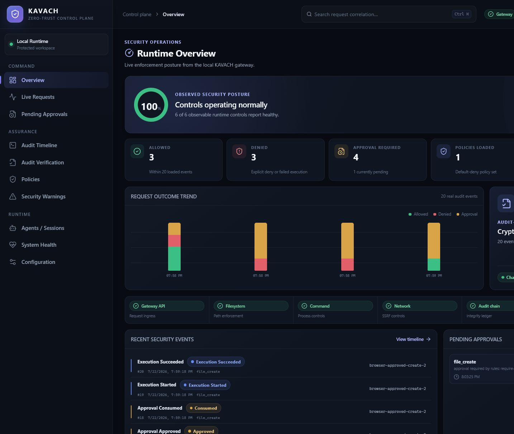
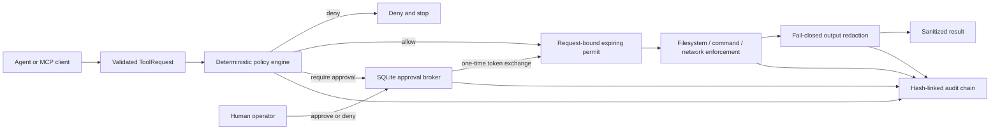
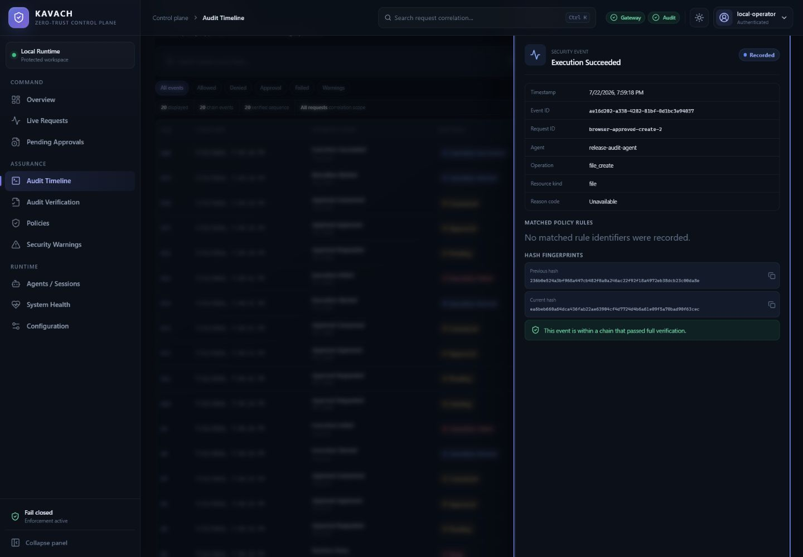
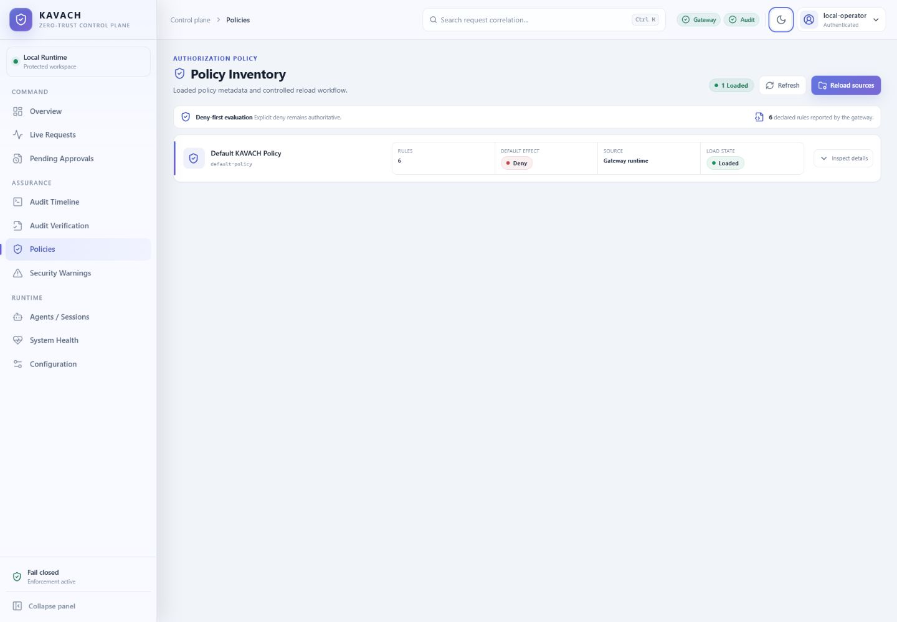
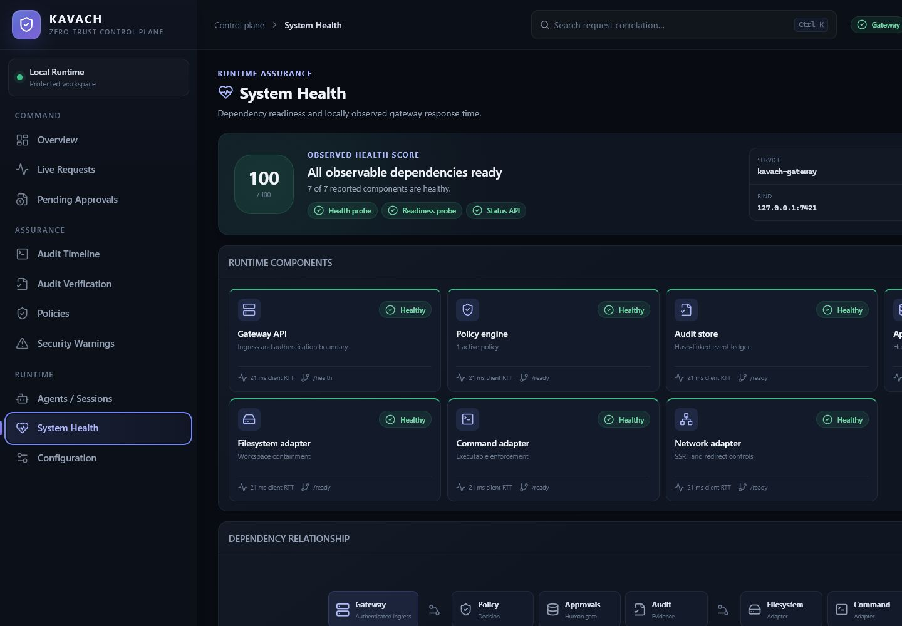
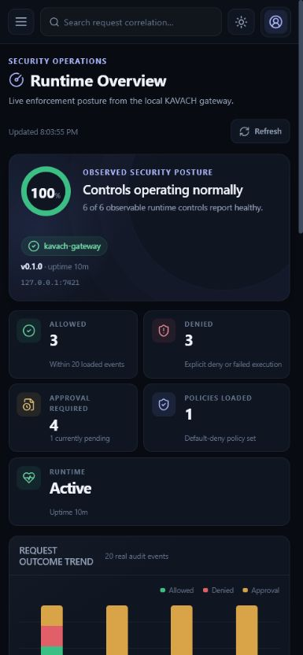

# KAVACH

**Default-deny authorization and enforcement for AI agent tool calls.**

KAVACH sits between an agent and the filesystem, command, network, or MCP tool
it wants to use. Every request is validated, evaluated against explicit policy,
bound to a short-lived permit, enforced at the adapter boundary, redacted, and
written to a tamper-evident audit chain.

> **Pre-release — v0.1.0.** KAVACH is under active development. APIs,
> configuration, and policy schemas may change before a stable release. It has
> not received an independent security audit or production certification.



## Why KAVACH

Agent tool calls cross real trust boundaries. KAVACH gives operators one local
control plane for deciding what is allowed, requiring a human for sensitive
operations, enforcing the resulting decision, and retaining evidence of what
happened.

- **Deterministic policy** — versioned TOML policies, default deny, explicit
  deny precedence, and allow / deny / require-approval effects.
- **Request-bound authority** — expiring permits and single-use approval tokens
  are bound to the original request digest and enforced server-side.
- **Filesystem controls** — lexical normalization, workspace containment at
  execution time, atomic writes, and size and directory-entry limits.
- **Command controls** — executable allowlists, dangerous-operation detection,
  argument limits, and timeouts.
- **Network controls** — HTTP/HTTPS scheme checks, DNS and resolved-address
  validation, redirect reauthorization, header validation, and cloud metadata
  endpoint blocking.
- **Fail-closed redaction** — detectors for credentials, bearer tokens, JWTs,
  PEM keys, GitHub and AWS keys, exact secrets, and high-entropy values.
- **Human approvals** — SQLite-backed approval state with bounded queues,
  expiry, explicit approve/deny transitions, and hashed tokens at rest.
- **Tamper-evident audit** — SHA-256 hash-linked SQLite events with full-chain
  verification.
- **Local gateway and console** — authenticated REST APIs plus a responsive
  React operator dashboard served by the gateway.
- **MCP adapter** — line-delimited JSON-RPC stdio proxy that evaluates MCP tool
  calls before forwarding them to a downstream server.

## Architecture



A policy decision does not perform an operation. The selected enforcement
adapter rechecks permit binding, scope, expiry, containment, and secret material
immediately before the side effect. See [the architecture
guide](docs/architecture.md) for component boundaries and the complete flow.

## Dashboard

The dashboard uses only gateway responses: runtime status, policy state,
approvals, audit events, and chain verification. The bearer token lives in
React/module memory only; it is not written to `localStorage` or
`sessionStorage`, so a refresh requires authentication again. Theme preference
is the only dashboard setting persisted in browser storage.

| Audit event detail | Policy state in light mode |
|---|---|
|  |  |

| System health | Responsive mobile overview |
|---|---|
|  |  |

## Quick start

### Prerequisites

- Rust 1.85 or newer
- Node.js and npm for the dashboard build
- SQLite is bundled through the Rust dependency; no separate server is needed

Clone and validate the workspace:

```bash
git clone https://github.com/MadB0i/KAVACH.git
cd KAVACH
cargo build --workspace --all-features
cargo run -p kavach-cli -- policy validate --file config/policy.example.toml
npm --prefix dashboard ci
npm --prefix dashboard run build
```

### Supply the gateway token

The operator must set `KAVACH_GATEWAY_TOKEN` before gateway startup. It must be
exactly 64 hexadecimal characters (32 random bytes). KAVACH rejects a missing
or malformed value and does not generate or print one.

On Linux or macOS with OpenSSL:

```bash
export KAVACH_GATEWAY_TOKEN="$(openssl rand -hex 32)"
```

On Windows PowerShell 5.1 or newer:

```powershell
$bytes = New-Object byte[] 32
$rng = [System.Security.Cryptography.RandomNumberGenerator]::Create()
try { $rng.GetBytes($bytes) } finally { $rng.Dispose() }
$env:KAVACH_GATEWAY_TOKEN = -join ($bytes | ForEach-Object { $_.ToString('x2') })
```

Treat this environment variable as a credential: do not place its value in
source files, URLs, logs, screenshots, or shell history.

### Run the gateway and dashboard

Build the dashboard, then start the gateway:

```bash
npm --prefix dashboard run build
cargo run -p kavach-cli -- serve --config config/kavach.example.toml
```

Open <http://127.0.0.1:7421/dashboard/> and enter the same operator-supplied
token. The example configuration binds to loopback, loads
`config/default-policy.toml`, and stores audit and approval data under `data/`.
The public probes are `/health` and `/ready`; `/api/*` requires bearer
authentication.

For dashboard development, keep the gateway on port 7421 and run Vite's proxy
in another terminal:

```bash
npm --prefix dashboard run dev
```

Then open <http://127.0.0.1:7422/dashboard/>. On Windows hosts that block npm
PowerShell shims, use `npm.cmd` with the same arguments.

## Policy example

Policies are declarative, versioned TOML. This example allows source reads,
requires approval for file writes, explicitly denies sensitive files, and
denies everything unmatched:

```toml
schema_version = 1

[policy]
id = "agent-policy"
name = "Agent policy"
description = "Default-deny policy for a local agent"
default_effect = "deny"

[[rules]]
id = "allow-source-read"
description = "Allow source files to be read"
effect = "allow"

[rules.conditions]
operations = ["file_read"]
resource_kinds = ["file"]
path_globs = ["src/**"]

[[rules]]
id = "approve-file-write"
description = "Require an operator before changing files"
effect = "require_approval"

[rules.conditions]
operations = ["file_write", "file_create", "file_delete", "file_move"]
resource_kinds = ["file"]

[[rules]]
id = "deny-sensitive-files"
description = "Deny common credential files"
effect = "deny"

[rules.conditions]
operations = ["file_read", "file_write", "file_delete"]
resource_kinds = ["file"]
path_globs = [".env", ".env.*", "**/.env", "**/.env.*", "**/.ssh/**"]
```

Rules use AND semantics across populated condition dimensions. Explicit deny
matches outrank approval and allow matches regardless of rule order. The full
schema examples are [`config/policy.example.toml`](config/policy.example.toml)
and [`config/default-policy.toml`](config/default-policy.toml).

## CLI

The `kavach` binary exposes validation, policy explanation, audit, approval,
gateway, and MCP operations with human or JSON output:

```bash
# Environment and input validation
cargo run -p kavach-cli -- doctor
cargo run -p kavach-cli -- config validate --file config/kavach.example.toml
cargo run -p kavach-cli -- request validate --file tests/fixtures/request_allow.json

# Policy decisions
cargo run -p kavach-cli -- policy validate --file config/policy.example.toml
cargo run -p kavach-cli -- policy check \
  --policy config/policy.example.toml \
  --request tests/fixtures/request_allow.json
cargo run -p kavach-cli -- policy explain \
  --policy config/policy.example.toml \
  --request tests/fixtures/request_allow.json

# Approval and audit operations
cargo run -p kavach-cli -- approval --config config/kavach.example.toml list
cargo run -p kavach-cli -- audit verify --database data/kavach-audit.db
cargo run -p kavach-cli -- audit list --database data/kavach-audit.db

# Machine-readable output
cargo run -p kavach-cli -- --output json policy check \
  --policy config/policy.example.toml \
  --request tests/fixtures/request_allow.json
```

Policy checks return process exit code `0` for allow, `10` for deny, and `11`
for require-approval. Input/config, policy, audit, internal, and unavailable
errors use distinct non-zero codes; run `kavach --help` for the current command
surface.

## MCP usage

The CLI can act as a stdio security adapter between an MCP client and a
downstream executable named `mcp-server`:

```bash
cargo run -p kavach-cli -- mcp serve --config config/kavach.example.toml
```

For an MCP client that accepts command/argument configuration, build the CLI
and point the client at the resulting binary:

```json
{
  "mcpServers": {
    "kavach": {
      "command": "/absolute/path/to/kavach",
      "args": [
        "mcp",
        "serve",
        "--config",
        "/absolute/path/to/kavach.example.toml"
      ]
    }
  }
}
```

The current CLI expects `mcp-server` to be available on `PATH`; the library API
supports supplying a different command and arguments. The adapter uses a fixed
local agent/session identity in the CLI today. These constraints are tracked as
pre-release limitations, not hidden configuration options.

## Verification snapshot

The current audited working tree was verified locally on Windows on 2026-07-22.
Counts are executable tests, not estimates:

| Suite | Result |
|---|---:|
| Rust workspace, debug, all features | 644 passed |
| Rust workspace, release, all features | 644 passed |
| Dashboard Vitest suite | 39 passed |
| Example binaries | 6 binaries passed; `demo-agent` passed 10 scenarios |
| PowerShell demo | 6 example binaries passed |

The full local verification also passed formatting, all-target/all-feature
checking, Clippy with warnings denied, documentation generation, benchmark
compilation, dashboard lint, dashboard production build, example policy/config
validation, and audit-chain verification. This snapshot does not claim that
remote CI, nightly fuzzing, or unrun operating systems passed. See the
[implementation state](docs/implementation-state.md) and [agent
handoff](docs/agent-handoff.md) for the recorded audit scope.

## Security principles

- **Default deny:** malformed, unknown, or unmatched requests fail closed.
- **Deny precedence:** an explicit deny cannot be overridden by allow or
  require-approval.
- **Bound authority:** approvals and permits are request-bound, expiring, and
  single-use; clients cannot construct valid authority from permit metadata.
- **Enforce at the boundary:** filesystem containment, command restrictions,
  and resolved network targets are checked where the side effect occurs.
- **Redact before release:** required redaction failures stop execution rather
  than returning uninspected output.
- **Audit required transitions:** configured fail-closed audit failures prevent
  protected operations from silently proceeding.
- **Minimize credential exposure:** the gateway stores a hash for comparison,
  approval tokens are hashed at rest, API records omit raw approval tokens, and
  the dashboard bearer token is memory-only.
- **No unsafe Rust:** the workspace forbids `unsafe` code through shared lints.

Read [`SECURITY.md`](SECURITY.md) for disclosure instructions and the explicit
security boundary.

## Honest limitations

- KAVACH is an authorization and enforcement layer, **not an operating-system
  sandbox**. Use containers, service accounts, filesystem permissions, and
  outbound network controls for defense in depth.
- Policy path matching is lexical. Filesystem-aware containment is performed by
  the enforcement adapter at execution time.
- Tamper-evident audit hashes make modification detectable; they cannot stop an
  attacker with database write access from deleting or replacing the database.
- Raw approved tokens and issued permits are process-local and do not survive a
  gateway restart. Pending approval records and audit events do persist.
- Entropy-based secret detection is heuristic. Non-UTF-8 or oversized output is
  rejected rather than returned without redaction.
- Dashboard authentication is intentionally non-persistent; refreshing the
  page requires the gateway token again.
- The MCP CLI currently fixes the downstream executable name and local identity
  as described above.
- No penetration-test, load-test, hyperscale, or security-certification claim
  is made for this pre-release.

## Supported platforms

| Platform | Current status |
|---|---|
| Windows x86_64 | Full local debug/release matrix verified |
| Linux x86_64 | GitHub Actions workflow configured; not verified in the current local audit |
| macOS x86_64 | GitHub Actions workflow configured; not verified in the current local audit |

The minimum supported Rust version is 1.85 (edition 2024). Policies that name
executables or platform-specific paths should be reviewed on every target OS.

## Contributing and project policy

- [Contributing guide](CONTRIBUTING.md)
- [Security policy and private disclosure](SECURITY.md)
- [Architecture](docs/architecture.md)
- [Implementation state](docs/implementation-state.md)
- [Changelog](CHANGELOG.md)
- [Apache License 2.0](LICENSE)

Contributions are welcome, but v0.1.0 remains a pre-release. Please run the
verification matrix in the contributing guide before opening a pull request.
