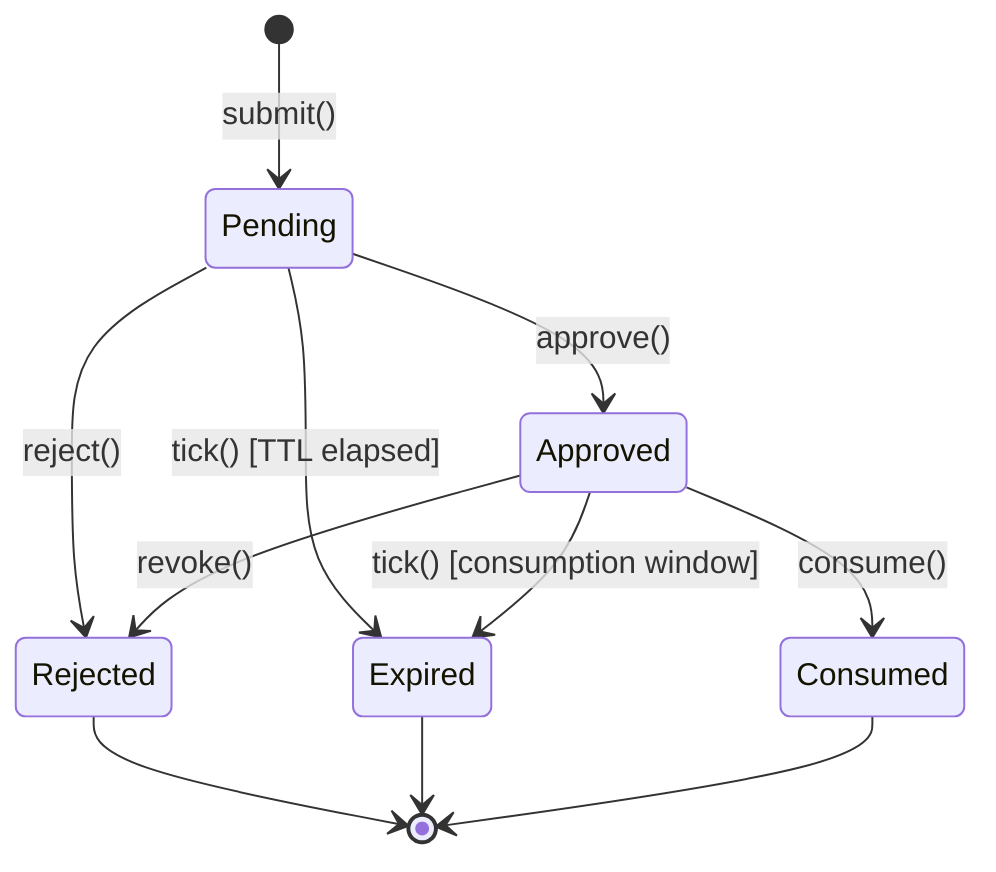

# Human Approval System

The Human Approval system implements the **break-glass approval workflow** for
high-risk tool invocations. Before a privileged tool executes, the broker
creates a **pending approval request**; a human delegate must approve or reject
it via an out-of-band channel (e.g. Slack, web dashboard).

## Architecture

```
  ToolRequest ──► ApprovalBroker ──► ApprovalStore (SQLite)
                       │
                       ▼
                AuditStore (append-only log)
```

| Component | Crate | Role |
|-----------|-------|------|
| `ApprovalBroker` trait + `SqliteApprovalBroker` | `kavach-approval` | Orchestrates submission, approval, rejection, timeout, and consumption |
| `SqliteApprovalStore` | `kavach-approval` | SQLite-backed persistence (pub(crate)) |
| `ApprovalToken` | `kavach-approval` | CSPRNG 256-bit bearer token, SHA-256 hashed at rest |
| `Clock` trait | `kavach-approval` | Time source (real or fake for testing) |
| `AuditStore` | `kavach-audit` | Append-only log of every state transition |

## State Machine



**Six states** (`ApprovalState`):

| State | Meaning | Allowed next states |
|-------|---------|-------------------|
| `Pending` | Waiting for human decision | Approved, Rejected, Expired |
| `Approved` | Human said yes, ready to consume | Consumed, Expired, Rejected (revoke) |
| `Rejected` | Human said no (or revoked) | Terminal |
| `Expired` | TTL or consumption window elapsed | Terminal |
| `Consumed` | Token presented and consumed | Terminal |
| `Cancelled` | Request cancelled before decision | Terminal |

## Token Lifecycle

1. **Generation** — `ApprovalToken::generate()` produces a 256-bit (32-byte)
   CSPRNG value formatted as 64 hex chars. Uses `getrandom` (syscall-backed).
2. **Storage** — The raw token is hashed with SHA-256 before being written to
   SQLite. `hash()` returns a 32-byte digest. The database **never** stores the
   raw token.
3. **Delivery** — `submit()` returns the raw `ApprovalToken` to the caller. It is
   the caller's responsibility to deliver the token to the human out-of-band.
4. **Verification** — `approve()`, `reject()`, and `consume()` accept a raw
   `ApprovalToken`, hash it, and compare against the stored digest using
   `verify_hash()` (constant-time comparison to prevent timing attacks).

## Request Digest Binding

Each pending approval is cryptographically bound to the original `ToolRequest`
via a **request digest**:

```
digest = SHA-256(concat(
    request_id.as_bytes(),
    resource.as_bytes(),
    action.as_bytes(),
    subject.to_string().as_bytes(),
))
```

The digest is stored in `approvals.request_digest` and verified on every
`approve()` / `reject()` / `consume()` call. This prevents a token leaked for
one request from being replayed against a different request.

## Expiry

- **Pending TTL** — configurable via `ApprovalStoreConfig::request_ttl`
  (default 30 minutes). When exceeded, the broker transitions `Pending → Expired`.
- **Consumption window** — fixed at 5 minutes after approval. If the token is
  not consumed within this window, `Approved → Expired`.
- Both checks happen inside `tick()` and are enforced atomically via SQLite
  `UPDATE ... WHERE` with timestamp comparisons.

## Concurrency

- Every state transition runs inside a `BEGIN IMMEDIATE` transaction, which
  prevents concurrent readers from observing intermediate states and serializes
  writers.
- `submit()` checks for duplicate active approvals (same request_id + state IN
  (Pending, Approved)) within the same transaction.
- `tick()` expires only rows that still match the expected state, so concurrent
  `approve()` and `tick()` cannot conflict.
- Busy timeout is set to 5000ms to handle contention without immediate failure.

## SQLite Persistence

- **WAL mode** for concurrent read performance.
- **Foreign keys** enabled.
- **Schema version** tracked in `user_version` pragma with migration support.
- Paths: ephemeral (`:memory:`) for tests; file-based for production.

## Audit Integration

Every state transition writes a structured audit record:

| Field | Value |
|-------|-------|
| `approval_id` | The `ApprovalId` |
| `request_id` | The original `RequestId` |
| `from_state` / `to_state` | Before/after `ApprovalState` |
| `actor` | Who triggered the transition (`ApprovalActor`) |
| `token_redacted` | Whether a token was presented (yes/no — token itself is never logged) |

## Redaction Boundary

- `ApprovalToken` implements `Debug` and `Display` as `"<redacted>"`.
- Audit records explicitly **omit** the raw token; only a boolean
  `token_redacted` is recorded.
- The request digest is not human-readable (SHA-256 hex).

## Cross-Database Limitation

The approval system is tied to a single process's state. There is no cross-node
coordination or distributed consensus. HA deployments must either:
1. Route all approvals for a given `RequestId` to the same broker instance; or
2. Share the SQLite database file via a network filesystem (not recommended
   for write-heavy loads).

## Threat Model

| Threat | Mitigation |
|--------|-----------|
| Token leaked at rest | Only SHA-256 hash stored in DB |
| Token leaked in transit | Caller's responsibility (TLS, out-of-band) |
| Token replayed for different request | Request digest binding |
| Token brute-forced | 256-bit entropy / SHA-256 preimage resistance |
| Timing attack on token comparison | `subtle::ConstantEq` constant-time comparison |
| Concurrent race on state transition | `BEGIN IMMEDIATE` + `WHERE state = ?` |
| Token logged in audit | Explicit redaction, boolean only |
| Clock manipulated to extend TTL | `FakeClock` only in test, `RealClock` delegates to `SystemTime` |
