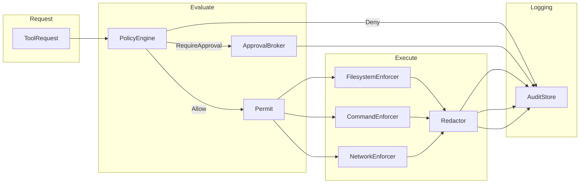
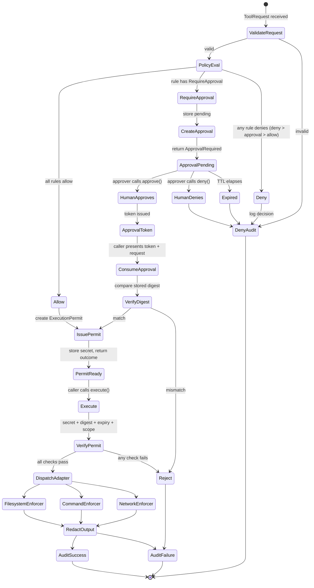

# KAVACH Runtime — End-to-End Orchestration

## Architecture

The runtime (`kavach-runtime`) orchestrates the full security flow: policy
evaluation, human approval, permit issuance, enforcement, audit logging, and
secret redaction.  Each step is handled by a dedicated adapter crate.



## Evaluation Flow



## Core Types

### `KavachRuntime`
The production runtime.  Fields:
- `engine: PolicyEngine` — read-only policy snapshot
- `config: RuntimeConfig` — permit TTL, audit fail-closed, redaction, dry-run
- `registry: AdapterRegistry` — filesystem / command / network enforcers
- `broker: Arc<dyn ApprovalBroker>` — SQLite-backed approval state machine
- `audit_store: AuditStore` — tamper-evident append-only log
- `redactor: Option<Arc<dyn Redactor>>` — optional secret redaction

### `RuntimeConfig`
| Field | Type | Default | Purpose |
|-------|------|---------|---------|
| `permit_ttl` | `Duration` | 300s | Lifetime of an issued ExecutionPermit |
| `audit_fail_closed` | `bool` | true | Whether audit failures reject the request |
| `redaction_enabled` | `bool` | false | Whether to redact summaries and outputs |
| `max_sanitized_summary_length` | `usize` | 4096 | Max chars in sanitized log summaries |
| `dry_run` | `bool` | false | If true, evaluate but never execute |

### `RuntimeOutcome`
```rust
pub enum RuntimeOutcome {
    Denied { request_id, reason_code, matched_rule_ids, sanitized_summary, audit_event_id },
    ApprovalRequired { request_id, approval_id, sanitized_summary, audit_event_id },
    Permitted(PermittedOutcome),
}
```

### `PermittedOutcome`
Wraps an `ExecutionPermit` with its 256-bit secret.  The secret is accessible
only through `secret()` / `into_secret()` — never logged or serialised.

### `RuntimeBuilder`
Builder pattern for constructing `KavachRuntime`:
```rust
RuntimeBuilder::new()
    .with_config(config)
    .with_workspace_root(path)
    .with_approval_db(path)
    .with_audit_db(path)
    .with_redactor(arc_redactor)
    .add_policy(policy)
    .build()
```

## Security Properties

1. **Request binding**: Every `ExecutionPermit` carries a SHA-256 digest of the
   original `ToolRequest`.  Execution verifies the digest matches; a modified
   request is rejected even with a valid permit.

2. **Single-use permits**: Permits are consumed on first execution.  Replay
   attacks are detected via `consumed` flag.

3. **Time-limited**: Permits expire after `permit_ttl`.  Expired permits are
   rejected at execution time.

4. **Scope enforcement**: Each permit carries a `PermitScope` (FilesystemRead,
   FilesystemWrite, FilesystemMutation, CommandLowRisk, CommandElevated,
   CommandDestructive, NetworkRequest).  The runtime verifies that the
   permit's scope is sufficient for the request's operation.

5. **Approval binding**: Approval tokens are bound to the request digest.
   `consume_approval()` re-verifies the digest before issuing a permit,
   preventing a stolen token from being used with a different request.

6. **Audit fail-closed**: When `audit_fail_closed` is true, any audit
   append failure causes the operation to be rejected.

7. **Redaction**: If `redaction_enabled`, summaries and execution outputs
   pass through the `Redactor` before logging or returning.

## `AdapterRegistry` Operation Resolution

| Operation | Adapter Kind |
|-----------|-------------|
| `FileRead`, `FileWrite`, `FileCreate`, `FileDelete`, `FileMove`, `DirectoryList`, `DirectoryCreate`, `DirectoryDelete` | `Filesystem` |
| `CommandExecute` | `Command` |
| `NetworkRequest` | `Network` |
| `SecretAccess`, `ToolInvoke` | `MissingAdapter` (error) |

## Error Types

`RuntimeError` variants:
- `InvalidRequest(String)` — request validation failed
- `PolicyFailure(String)` — policy engine construction failed
- `Denied { .. }` — request explicitly denied
- `ApprovalFailure(String)` — approval broker error
- `AuditFailure(String)` — audit store error
- `RedactionFailure(String)` — redactor error
- `PermitFailure(String)` — permit verification failed
- `PermitScopeMismatch { expected, actual }` — insufficient scope
- `MissingAdapter(String)` — no adapter for operation
- `UnsupportedOperation` — operation not supported by adapter
- `FilesystemFailure(String)`, `CommandFailure(String)`, `NetworkFailure(String)` — adapter errors
- `InvalidExecutionInput(&str)` — wrong input type for adapter
- `DryRunExecutionRejected` — execution blocked in dry-run mode
- `ConfigurationFailure(String)` — invalid config
- `InternalConsistencyFailure(String)` — RNG / invariant failure

## Test Coverage (43 runtime tests)

| Category | Tests |
|----------|-------|
| Core evaluation (allow/deny/approval) | 7 |
| Permit binding + digest | 2 |
| Permit replay + reuse | 2 |
| Approval lifecycle | 6 |
| Concurrency | 2 |
| Configuration edge cases | 5 |
| Multi-policy precedence | 3 |
| Permit scope enforcement | 1 |
| Execution flow | 5 |
| ExecutionInput dispatch | 2 |
| Builder edge cases | 2 |
| Redaction integration | 1 |
| Audit configuration | 1 |
| **Total** | **43** |
